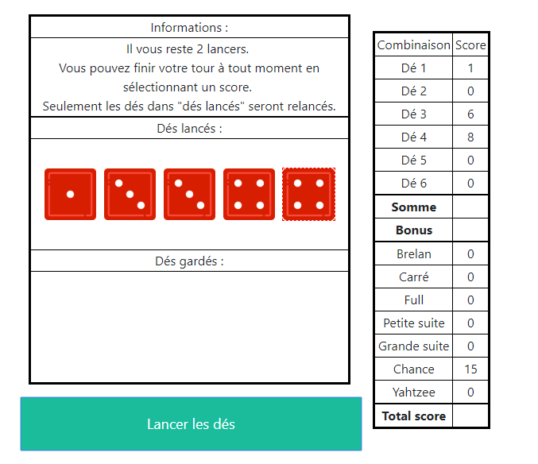

# Yahtzee

 

An original Yahtzee, but a joker is given by doing a yahtzee. Made for the Web programming (client side course at the Bordeaux Institude of Technology (grade: 19/20).

## 1. Getting started
### 1.1 Prerequisites
A web browser.

### 1.2 How to use it
Go to my [website](https://n3roo.github.io/projects/yahtzee.html#content) to play the game.

### 1.3 Setting up your dev environment
Open you favorite web IDE, and edit script.js.

## 2. Miscellaneous
### 2.1 Changelog
The changelog is available [here](CHANGELOG.md).

### 2.2 Authors
- **N3ROO** - *Initial work* - [Github](https://github.com/N3ROO) [Website](https://n3roo.github.io/)

### 2.3 License
This project is licensed under the GPL-3.0 license - see the [LICENSE.md](<urltolicense>) file for details